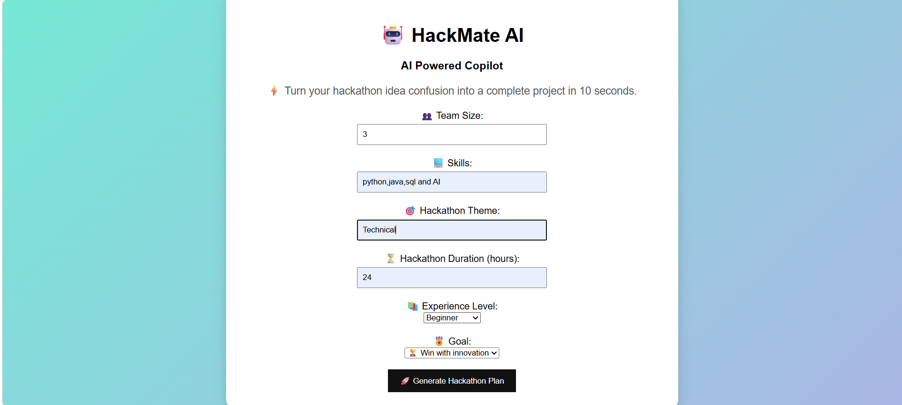
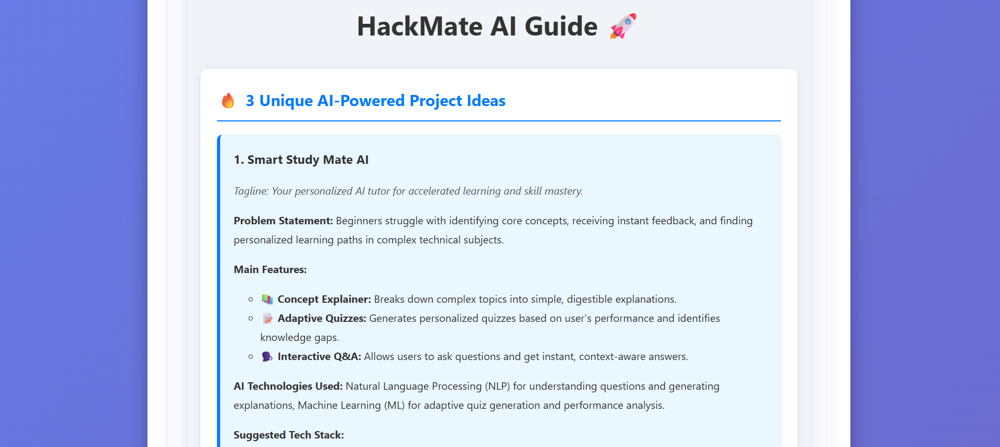
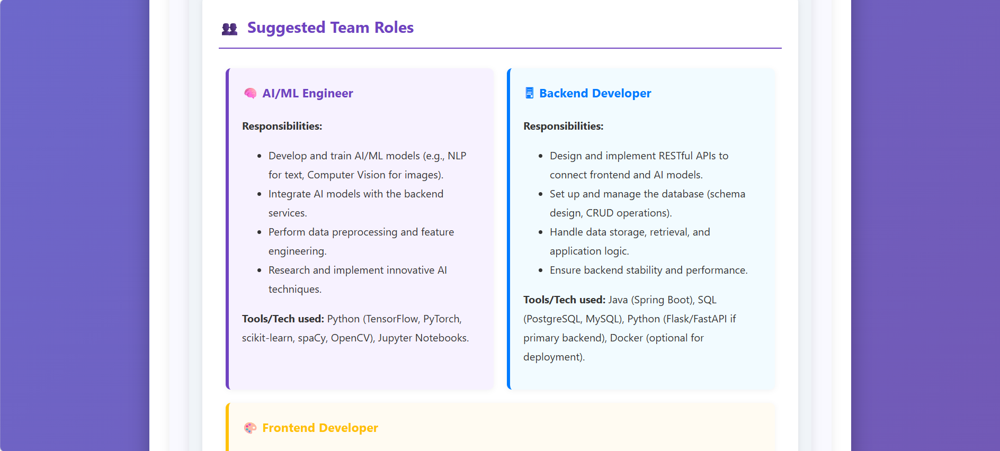
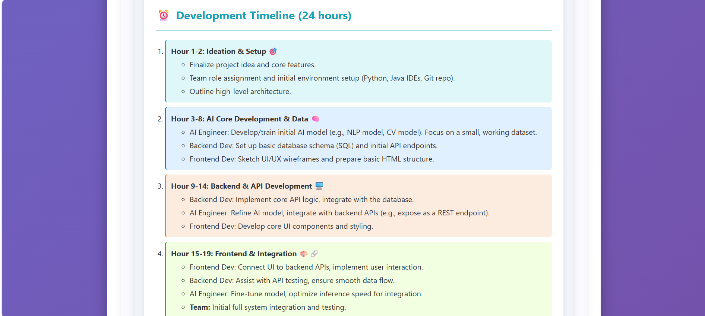
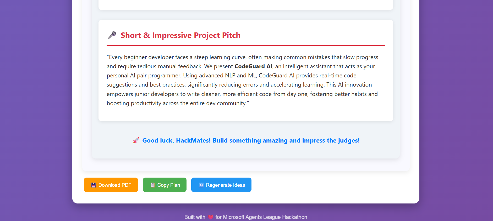

🚀 HackMate AI-AI Powered Copilot
⚡ Tagline:--
   From idea to demo, powered by AI: Brainstorm, Build and Win

🧠 About the Project:

HackMate AI is an AI-powered hackathon copilot that helps students and developers turn raw ideas into complete, structured, and presentation-ready hackathon projects in seconds.

Instead of wasting time struggling with:

💡 Idea generation
🧩 Team planning
⏳ Time management
🎤 Pitch creation

HackMate AI acts as an all-in-one hackathon assistant powered by Google Gemini AI.

It works like a:

🧠 Mentor + Planner + Idea Generator + Pitch Creator

✨ Features:

🔥 Generates 3 unique AI-powered project ideas instantly
👥 Smart team role distribution (Frontend, Backend, AI/ML)
⏰ Hour-wise hackathon execution roadmap
🎤 Startup-style pitch generator
🧠 Personalized output based on skills, theme & experience
⚡ Fast AI response using Gemini API
🎨 Clean UI with loading animation
📄 Downloadable project plan (PDF support)
🏗️ Tech Stack:-
    Frontend: HTML, CSS, JavaScript
    Backend: Python (Flask)
    AI Model: Google Gemini API (genai)
    PDF Generation: ReportLab
    Environment Management: python-dotenv
🚀 How It Works
User enters:
Team size
Skills
Hackathon theme
Duration
Experience level
Goal
AI processes inputs using Gemini Generates
💡 3 Project Ideas:
👥 Team Roles
⏰ Development Timeline
🎤 Final Pitch
Displays structured hackathon-ready output instantly
🧪 Installation & Setup
git clone https://github.com/veluruhimasri18-glitch/HackMate-AI.git

cd HackMate-AI

pip install -r requirements.txt

python app.py
🔑 Environment Variables:

Create a .env file in root directory:

GEMINI_API_KEY=your_api_key_here

## 📸 Screenshots

### 🏠 Home Page

### 🤖 AI Generated Ideas

## 💡 Project Ideas

## 👥 Team Roles

## ⏰ Hackathon Timeline

### 🎤 Pitch Section

📌 Future Improvements:
🌐 Deploy online (Render / Vercel)
💬 AI chat mentor mode
📊 Idea scoring system
📁 Export full project as ZIP
🎤 Voice input support

❤️ Built For Microsoft Agents League Hackathon
